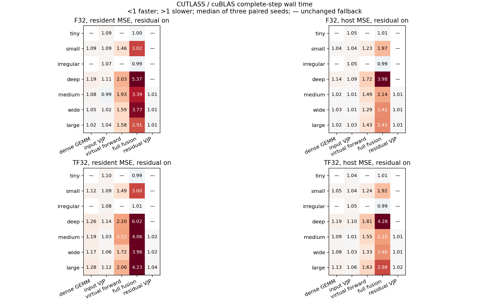
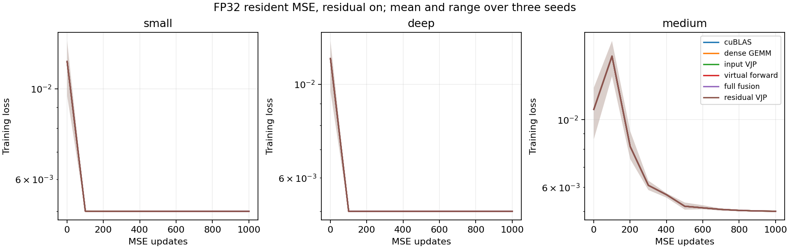

# CUTLASS experiment results — 2026-10-10

Branch: `experiment/cutlass-kan-fusion`. Frozen production control: `37a07f8`.
Research implementation: `b27eecb`. The default backend is unchanged.

## Decision

Keep the opt-in experimental backend and all negative evidence on this branch.
Do not promote a global replacement: the frozen three-tile FP32 SIMT search
does not beat the existing cuBLAS/custom dispatch across the complete-step matrix.
A separate shape-specific input-VJP search finds a small repeated benefit on
some narrow networks. This is a tuning lead, not a production bitwise-parity
result or a general conclusion about CUTLASS, Tensor Cores or other GPUs.

## What was actually run

Actual C++20/CUDA CUTLASS mainloops, virtual Chebyshev operands and CTA-shared
input/residual epilogues; CUTLASS 3.9.2, RTX 3090 SM86. Three two-stage SIMT
tiles per operation. Changed contractions use full FP32 even inside the TF32
executor; unchanged operations retain cuBLAS TF32. FMA ON throughout this
series. See [implementation and installation](README.md).

Seven width/depth/batch configurations, Chebyshev K=7, residual off/on,
FP32/TF32, resident and host-batch MSE+L2+SGD. Three seeds, paired ABBA, five
timing windows per process. **3,024 confirmation processes, 15,120 windows,
2,872,800 measured full updates, 252 comparison groups**. Each comparison
contains 30 control and 30 candidate windows; ratios are medians of three
per-seed median ratios. Repeated processes are fresh models; the update total
is not one continuous training run. Setup is outside ms/step; process wall
time and commands are retained in [ledger](ledger.jsonl).

Resident timing includes graph replay, status interval 1 and synchronization.
Host timing includes four cyclic batches, validation/conversion/upload and
synchronization. Loss/parameter downloads for reporting are outside timing
windows. Both protocols use the same steps, warmup and data within each pair.
They represent different input protocols and must not be compared as one speedup.

## Global-tile confirmation

Ratios below are CUTLASS/control complete-step wall time (less than 1 is faster),
residual enabled. A dash means the operation retains the control dispatch;
differences in inactive cells are measurement noise. Full branch-off and host
results, absolute times and seed ranges: [summary](summary.md), [CSV](summary.csv).
Global selected tiles: mode 1=0, 2=1, 3=0, 4=2, 5=2.

| Case | FP32 dense | FP32 input | FP32 virtual forward | FP32 full | FP32 residual | TF32 full |
|---|---:|---:|---:|---:|---:|---:|
| tiny | — | 1.086 | — | 0.996 | — | 0.991 |
| small | 1.092 | 1.090 | 1.460 | 3.022 | — | 3.004 |
| irregular | — | 1.069 | — | 0.993 | — | 1.008 |
| deep | 1.194 | 1.106 | 2.033 | 5.369 | — | 6.023 |
| medium | 1.076 | 0.992 | 1.930 | 3.391 | 1.006 | 4.058 |
| wide | 1.045 | 1.024 | 1.588 | 3.766 | 1.014 | 3.959 |
| large | 1.023 | 1.036 | 1.582 | 2.908 | 1.010 | 4.232 |

Examples: large FP32 resident input fusion 17.614 → 18.229 ms/step; full
fusion 17.640 → 51.335 ms/step (2.908×). Large host FP32 full fusion
23.846 → 57.918 ms/step (2.433×). Large TF32 resident full fusion
11.858 → 50.211 ms/step (4.232×). Each absolute control comes from its own
ABBA pair, rather than one reused baseline. Wide FP32 input fusion is 2.4%
slower, residual fusion 1.4% slower. Medium FP32 input fusion is 0.8% faster
with residual enabled; below-1% differences are not promoted as a robust gain.

## Shape-specific input-VJP follow-up

The global tile 1 penalizes narrow shapes. Screen the same three already
validated tiles on independent seed 6, freeze a tile per (case,precision),
then confirm on new seeds 3/4/5 with ABBA, both protocols and both branches.
64 screen processes + 384 confirmation processes; 32 groups. No new kernel
or changed backend. [Selection](adaptive-selection.json), [all results](adaptive-summary.csv).

| Case / precision | Tile | Resident ratio (branch on) | Three-seed range | Host ratio |
|---|---:|---:|---|---:|
| tiny / f32 | 2 | 0.973 | 0.938–0.986 | 0.991 |
| tiny / tf32 | 2 | 0.998 | 0.993–0.999 | 1.005 |
| small / f32 | 2 | 0.984 | 0.978–0.990 | 0.991 |
| small / tf32 | 2 | 0.980 | 0.968–0.987 | 1.000 |
| irregular / f32 | 0 | 1.025 | 1.005–1.026 | 1.007 |
| irregular / tf32 | 2 | 0.991 | 0.989–1.007 | 0.991 |
| deep / f32 | 2 | 0.983 | 0.978–0.986 | 0.992 |
| deep / tf32 | 2 | 1.015 | 1.006–1.018 | 1.010 |

Small/deep FP32 resident gains repeat for all three seeds with either branch:
small 1.6–2.1%, deep 1.8–2.2% using tile 2. Host gains are smaller and deep
branch-on includes one losing seed. Small TF32 branch-on also improves 2.0%,
but deep TF32 loses 1.5–2.0%. Tiny FP32 branch-on has a much wider seed range;
its 2.7% median benefit is not a general tiny-network claim. Irregular FP32
selects tile 0 on screening but loses on confirmation: selection evidence
was retained rather than selecting again on the confirmation seeds.

## Longer actual learning

198 runs of 1,000 resident MSE+L2+SGD updates: small/deep/medium,
FP32/TF32, branch off/on, three seeds, control and every applicable mode.
These use the globally frozen tiles, not the adaptive follow-up tiles.
Synthetic sinusoidal inputs/targets with identical deterministic initializations;
this checks numerical trajectories, not task generalization. All runs finish
with finite losses. [Per-run loss and parameter comparison](learning-summary.csv).

| Precision | Final loss candidate/control range | Maximum normalized parameter drift |
|---|---|---:|
| FP32 | 0.999998700–1.000000093 | 1.812e-7 |
| TF32 | 0.997959606–1.000668322 | 1.435e-5 |

Parameter drift is `max(abs(candidate-reference)/(1+abs(reference)))`; both
final parameter dump SHA-256 digests and vector length are recorded. Binary
dumps are local ignored build outputs; archived curves and comparison CSVs
contain the evidence summary and allow fresh runs to be compared. Control
branch-on losses decrease from approximately 0.0108–0.0117 after update 1
to 0.0050 at update 1,000.

## Profiling and bottlenecks

Nsight Systems uses `--cuda-graph-trace=node`: 10 warmup + 5 measured updates
for wide/large FP32 resident branch-on, modes 0/2/3/4/5. Kernel percentages
include warmup and setup and are diagnostic, not the acceptance timings above.
An initial graph-granularity export exposed only the constructor fill kernel
in the kernel summary; [diagnostic](nsys-graph-granularity-diagnostic.csv).
It was rerun with node tracing and forced SQLite re-export.

Wide full fusion: virtual dC accounts for 61.6% of kernel time, virtual forward
27.9%, input fusion 5.2%. Large full fusion: virtual forward 47.5%, dC 38.2%.
The control trace already contains `cutlass_80_simt_sgemm_128x64_8x5_nt_align1`
under cuBLAS. Direct CUTLASS does not replace an unoptimized scalar GEMM.

Nsight Compute full-set metrics use kernel replay and its controlled clocks;
their duration is not substituted for unprofiled complete-step timing.

| Wide FP32 kernel | Registers/thread | Dynamic shared/block | Achieved occupancy | SM throughput | DRAM throughput |
|---|---:|---:|---:|---:|---:|
| Input VJP, tile 1, K=10 | 210 | 82.18 KB | 8.30% | 19.07% | 6.23% |
| Input VJP, tile 1, K=256 | 210 | 82.18 KB | 8.33% | 52.34% | 20.22% |
| Virtual forward, tile 2 | 148 | 8.70 KB | 24.11% | 33.54% | 1.50% |
| Virtual dC, final O=10 layer | 106 | 8.19 KB | 8.33% | 5.26% | 0.30% |
| Residual VJP, tile 2, K=256 | 72 | 24.83 KB | 24.62% | 34.36% | 25.80% |

Input tile 1 permits only one block/SM because of shared memory. The virtual
dC grid has 28 blocks for 82 SMs (0.09 waves/SM): long reduction K=8192 is not
split, so much of the GPU stays idle. Nsight warns about latency/issue-slot
utilization and local-memory access patterns. Source inspection shows repeated
basis recurrence, indexing and finite checks in virtual fragments, including
derivatives when only a basis value is loaded. Reduced global Phi traffic does
not compensate for those costs in this implementation. Zero register-spilling
requests were reported; local arrays should not be described as register spills.

The adaptive tile search addresses the oversized input-tile penalty; it does
not fix the virtual operand bottleneck. On the deep FP32 input VJP, switching
tile 1 to tile 2 changes the grid from 32 to 128 blocks, shared memory from
82.18 to 24.83 KB and registers/thread from 210 to 72. Theoretical occupancy
rises from 8.33% to 25%; achieved occupancy from about 8.4% to 13.1%.
Replay durations fall from 26.59/33.09 to 11.78/17.66 microseconds for the
last and preceding layers. This supports the separately measured full-step
effect; the replay timings themselves are not acceptance measurements.
See `ncu-deep-input-t{1,2}-metrics.csv`.
Further candidates, not measured here:
value-specific virtual iterators with controlled validation/reuse, split-K dC
with a fixed-order reduction and atomic rollback, native Tensor Core mainloops
under separately validated precision contracts. Repeating the current full
fusion architecture is not supported by the measurements.

## Validation and limits

180 mode/tile/precision/tail correctness combinations pass, plus an unchanged
FP64 case. Output, all input/parameter gradients, L2/SGD, graph/eager, zero
batch and overflow rollback checked. [Elementwise summaries](correctness-summary.csv).

| Precision | Max normalized output error | Gradient error | Updated parameter error |
|---|---:|---:|---:|
| FP32 | 4.036e-7 | 2.884e-8 | 9.241e-10 |
| TF32 | 6.117e-5 | 8.869e-6 | 8.838e-8 |

Graph/eager and overflow rollback comparisons are bitwise. Reordered GEMMs
are not generally bitwise to control; the experimental `1e-4`/`5e-3` gates
do not relax production contracts. FP64 retains the existing dispatch and
passes bitwise. [Tail iterator RED/GREEN](README.md#tail-regression) retained.

CTest: control experiment build 36/36, enabled-mode unsupported-family
fallback subset 6/6, independent CUDA-free CPU build 18/18. Two long unchanged
CPU tests (`initializer_training`, `residual_training`) were excluded; optional
NumPy bindings were not built. This is not a fresh complete 47-test production
acceptance run or an experimental FMA OFF validation.

Compute Sanitizer memcheck: mode 4/tile 2, FP32 branch-on `tail`, no errors
and no leaks. Racecheck, synccheck and initcheck pass mode 4/tile 2, FP32
branch-on `small`: zero hazards/errors/warnings, all lifecycle checks pass.
Each had a 240-second limit; all finished (racecheck 15.1 s, synccheck 2.7 s,
initcheck 3.0 s). [Commands and exits](sanitizer-results.json). These are
bounded cases, not sanitizer coverage of every architecture and precision.

All timed samples report two workspace allocations. Phi/scratch reservations
remain for fallbacks and changing batches; this series does not claim a
reserved-memory reduction. [GPU telemetry](gpu-state.csv) records clocks,
temperature, power, memory and utilization every 30 seconds. WDDM, unlocked
clocks and other desktop allocations can introduce variance; paired controls
and seed ranges are retained. High process utilization is not proof of high
SM efficiency, as the Nsight results show.

## Reproduction and archived evidence

[Protocol](PLAN.md), [setup and commands](README.md), raw stdout/stderr/exit
markers, [process ledger](ledger.jsonl), exported profiler CSVs, figures and
[hash manifest](manifest.json). `verify.py` audits canonical LF text hashes
and exact binary hashes without requiring a GPU. Large profiler binaries and
dependencies remain in ignored build folders. No public API/default change,
no backlog item reopened, B remains NEXT and M5 remains PLANNED.
